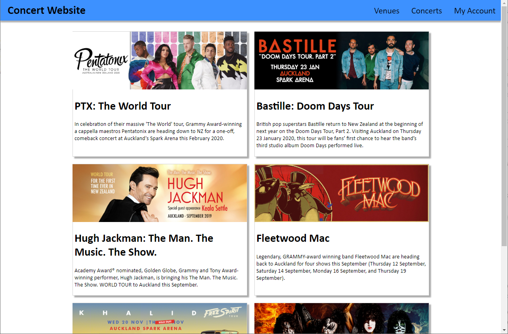
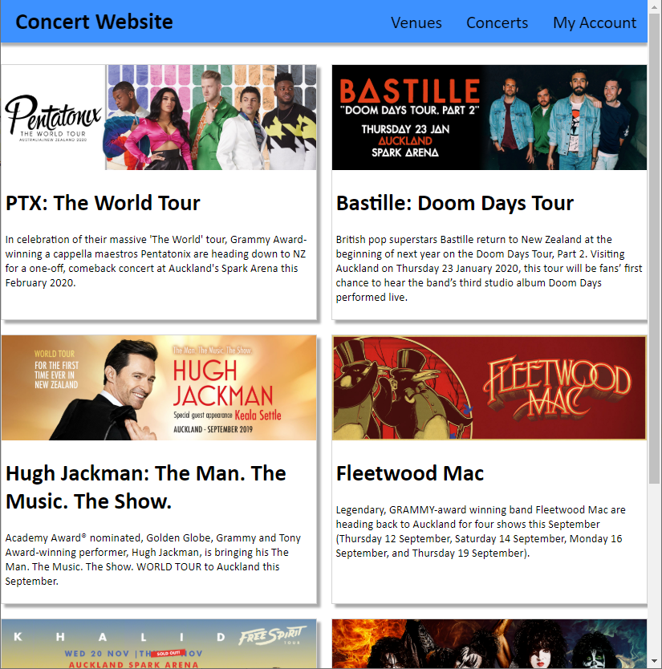
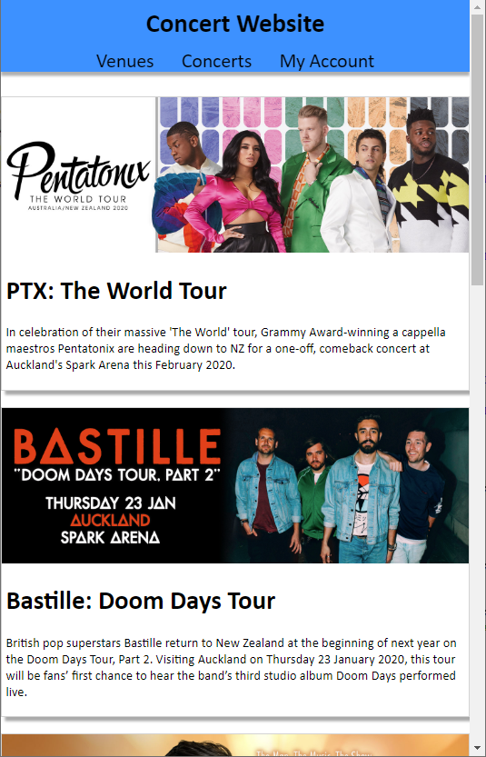
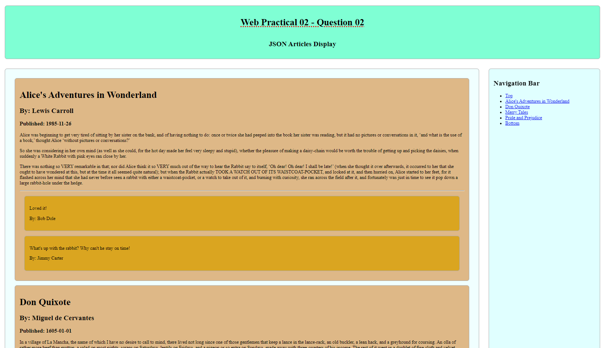
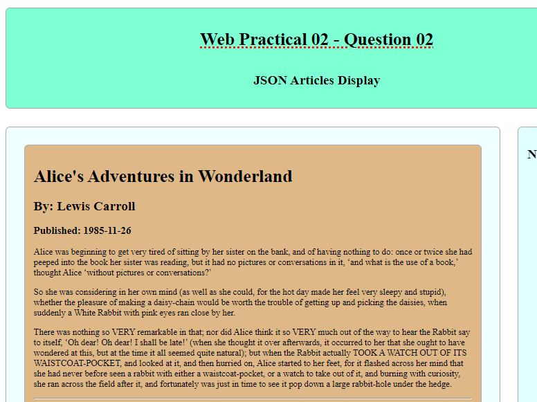
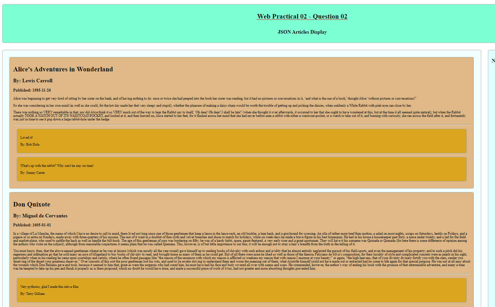
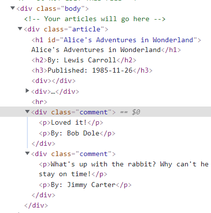
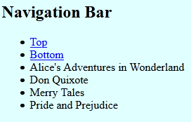
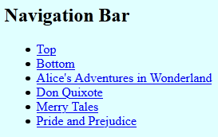
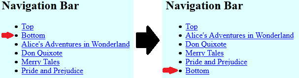

# Question One (25 marks)
In this question, we will appropriately style a webpage in a grid-style layout, then use JavaScript to add a small amount of interactivity.

Examining `question1.html`, you’ll notice that the page has several HTML elements, organized into a "navbar", and "card" `<div>`s. For the first part of this question, add CSS to `question1.css` so the page looks like the following screenshot:



## 1A) Styling (12 marks)
You should **only** edit `question1.css` for parts 1A) and 1B) unless you need to make small changes like adding an id.

To begin, apply styles to `question1.css` such that the website looks as per the above screenshot. Specifically, apply the following styles:

- *all elements* should have the Calibri font. If this is not available on a machine, then sans-serif font should be used by default.

- The `body` should have no margins.

- The `.nav` div should be `dodgerblue`, be stuck to the top of the page, and should have a 0px horizontal, 5px vertical box shadow colored as `rgba(96, 96, 96, 0.5)`. **Hint:** Investigate the CSS `box-shadow` property for this.

- The `.nav` div should lay out its child components using flexbox. Child components should be laid out in a row, with the spacing such that it is between the items, as shown in the screenshot. Child components should be centered horizontally.

- The header inside the nav should have a 10px top and bottom margin, and a 20px left and right margin.

- The spans inside the nav should have a 150% font size, 5px padding on all sides, and a 10px left and right margin.

- When the user mouses over one of the spans inside the nav, its background color should be set to `rgba(255, 255, 255, 0.5)`. The transition should occur smoothly over 0.5 seconds. A GIF of this transition can be seen in `spec/1A-animation.gif`.

- The `#container` div should have a top and bottom margin of 30px, and auto left and right margins. It should be 1000px wide.

- The `#container` div should lay out its child components using CSS grid. The grid should have two equally-sized columns, and auto rows. There should be a gap of 20px in between each grid item, both vertically and horizontally.

- The `.card` divs should have a 1px solid light gray border. In addition, they should have a dark gray box-shadow of 5px horizontally, 5px vertically.

- The `.card` divs should lay out their child components using flexbox. The flex direction should be column, and the content should be justified at the start.

- The `.card-image` images should have a width of 100%, and should have the following property set so that they maintain their aspect ratio when resized:

  ```css
  object-fit: cover;
  ```
- The `.card-body` divs should have a 5px margin on the bottom, left, and right.

## 1B) Responsiveness (7 marks)
Further style your design such that it is responsive. Specifically, apply the following styles:

- When viewing your webpage on a screen of size 1100px or less, the width of the container should be changed to 100%, and its left and right margins should be removed, as shown in the following screenshot:

  

- When viewing your webpage on a screen of size 800px or less, the container's grid should additionally be changed to have only one column. in addition, the navbar should change to a column layout, and should vertically and horizontally center its children. This can be seen in the following screenshot:

  
  
## 1C) Interaction with cards (6 marks)
You may **only** edit `question1.js` for part 1C). **Do not edit any other files!**

Finally, add JavaScript to your page so that users are visually notified when they have clicked on a card. Specifically, add code such that whenever the user clicks on one of the `.card` divs, its background color changes to `dodgerblue`, and *all other* card divs change back to their default background color. A GIF of this interaction can be seen in `spec/1C-animation.gif`.


# Question Two (25 marks)

For this question there two JavaScript files. There is a a `question02.js` in which you will make the edits to your code. There is also an `input_json.js` file which contains the data for the exercise. 

In this question you will use JavaScript to generate a page using data from a JSON structure. You will use a combination of your own code and the provided data to complete the task. All of your work will happen in the `question02.js` file. When complete, your page will look like this:




The JSON document containing the page information has been created and made available to you through the `INPUT_JSON` variable. Answering the questions below will require you to look at the structure of this data so that you can get information out of it. The definition for this can be found in the `input_json.js` file within the project.

The CSS has been written for you so make sure to read the instructions carefully and check the CSS to make sure the code you write creates HTML elements with the right structure, classes, ids etc to connect with the CSS that is provided to you.

For all steps of this task you may create your own functions to break the code down into smaller blocks if you want. 

---

## Part 1 - Loading articles (10 marks)

The first step is to create a loop to loop over the `INPUT_JSON` array and with each item, create the h1, h2, h3 and paragraph elements required for that article. For each article, the elements for that article will be contained within a div with the class `article`. All of your `article` divs will be contained within the div with the class `body` that has been provided to you in the `question02.html` file provided. Examine the structure of `INPUT_JSON` carefully and you will see that there is an array of article objects with this data for each article in it.

The article contents should be created for the following specifications:
- the `title` will be a `h1` element
- the `author` will be a `h2` element
- the `date` will be a `h3` element
- all the paragraphs in the `body` will be individual paragraph elements
- all of these elements will be created inside a `div` with the class `article` that will be contained within the `div` with the class `body` that is provided in the HTML file

These elements should be created for every article that is contained in the `INPUT_JSON` array and all articles should display on screen.

You should create the JavaScript code to generate all of these elements to these specifications within `question-2.js`. It is up to you how you create this but plan your code carefully and remember to test your code as you go with `console.log(...)` or the debugger. 

When this step is complete, the articles should appear something like this in the page:



If your CSS code is not displaying like this, check that you have created the right class on your div and nested it within the correct div. 

## Part 2 - Adding comment (10 marks)

Now you will add the comments to the page. When the comments are added correctly it should look like this:



Make sure to observe the structure of `input_json.js` to observe how the comments are contained. The CSS for the comments has been written already so make sure to generate the comments with the correct structure as specified.

The comments for each article should each be contained within a `div` with the class `comment` that is nested inside the `article` `div`. The may be multiple `comment` divs for one article if there are multiple comments. For each individual comment, the `author` and `message` of the comment should each be a separate paragraph within the `comment` div for that comment. When complete the comments should display similar to the screenshot above. 

You should also include an `hr` element between the article content and the comments. 

Here is an additional screen-shot of the structure of the DOM elements that should be generated by your code: 




## Part 3 - Adding navigation links (5 marks)

Create the necessary code, so that when each article is generated, a navigation entry is also created and inserted into the navigation bar. This may involve modifying some of the code you created in step 3.

Your code should add the list items to the navigation bar and appear something like this:



Next, you should make sure that the list items you create are functional navigation links to appropriate sections in the page.



Finally, you should make sure that the navigation links are added in between the `top` and `bottom` links. When complete it should look something like the image on the right:



Check that all navigation links are functional and link to the appropriate articles in the page.
